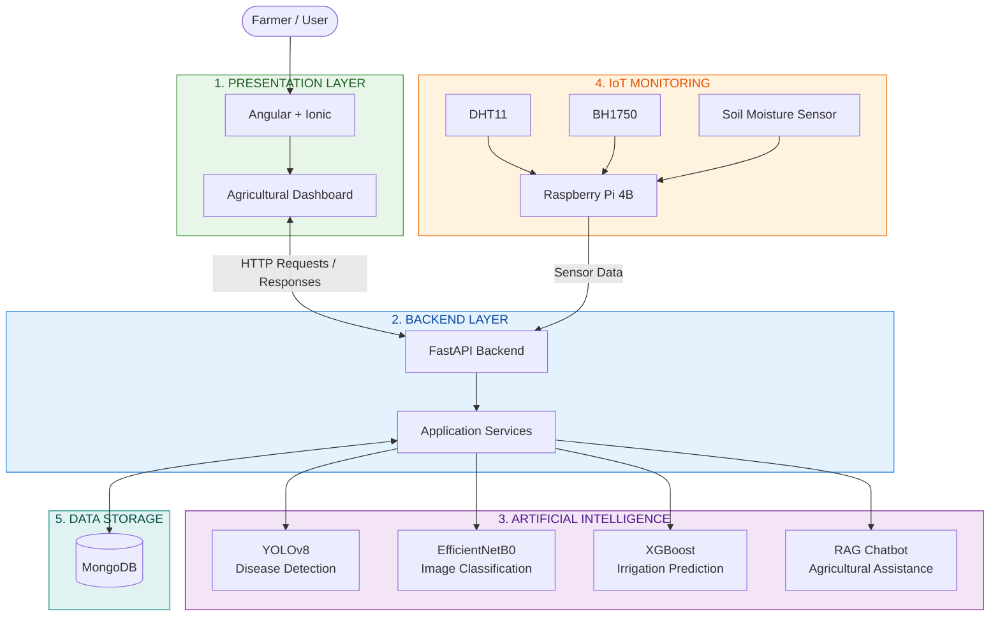

# AgriTunisie — System Architecture

```mermaid
flowchart TB

    USER(["Farmer / User"])

    subgraph FRONTEND["1. PRESENTATION LAYER"]
        direction LR
        APP["Angular + Ionic"]
        DASH["Agricultural Dashboard"]
        APP --> DASH
    end

    subgraph BACKEND["2. BACKEND LAYER"]
        API["FastAPI Backend"]
        SERVICES["Application Services"]
        API --> SERVICES
    end

    subgraph AI["3. ARTIFICIAL INTELLIGENCE"]
        direction LR
        YOLO["YOLOv8<br/>Disease Detection"]
        EFF["EfficientNetB0<br/>Image Classification"]
        XGB["XGBoost<br/>Irrigation Prediction"]
        RAG["RAG Chatbot<br/>Agricultural Assistance"]
    end

    subgraph IOT["4. IoT MONITORING"]
        direction LR
        PI["Raspberry Pi 4B"]
        DHT["DHT11"]
        BH["BH1750"]
        SOIL["Soil Moisture Sensor"]
        DHT --> PI
        BH --> PI
        SOIL --> PI
    end

    subgraph DATA["5. DATA STORAGE"]
        DB[("MongoDB")]
    end

    USER --> APP
    DASH <-->|HTTP Requests / Responses| API

    SERVICES --> YOLO
    SERVICES --> EFF
    SERVICES --> XGB
    SERVICES --> RAG

    PI -->|Sensor Data| API
    SERVICES <--> DB

    style FRONTEND fill:#E8F5E9,stroke:#388E3C,color:#1B5E20
    style BACKEND fill:#E3F2FD,stroke:#1976D2,color:#0D47A1
    style AI fill:#F3E5F5,stroke:#7B1FA2,color:#4A148C
    style IOT fill:#FFF3E0,stroke:#EF6C00,color:#E65100
    style DATA fill:#E0F2F1,stroke:#00897B,color:#004D40
```
