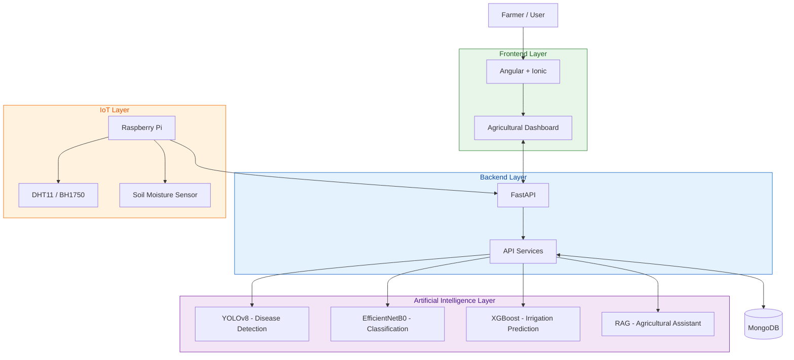

# AgriTunisie — System Architecture

```mermaid
flowchart TB
    U["Farmer / User"]

    subgraph FRONTEND["Frontend Layer"]
        A["Angular + Ionic"]
        B["Agricultural Dashboard"]
    end

    subgraph BACKEND["Backend Layer"]
        C["FastAPI"]
        D["API Services"]
    end

    subgraph AI["Artificial Intelligence Layer"]
        E["YOLOv8 - Disease Detection"]
        F["EfficientNetB0 - Classification"]
        G["XGBoost - Irrigation Prediction"]
        H["RAG - Agricultural Assistant"]
    end

    subgraph IOT["IoT Layer"]
        I["Raspberry Pi"]
        J["DHT11 / BH1750"]
        K["Soil Moisture Sensor"]
    end

    L[("MongoDB")]

    U --> A
    A --> B
    B <--> C
    C --> D

    D --> E
    D --> F
    D --> G
    D --> H

    I --> J
    I --> K
    I --> C

    D <--> L

    style FRONTEND fill:#e8f5e9,stroke:#2e7d32,color:#1b5e20
    style BACKEND fill:#e3f2fd,stroke:#1565c0,color:#0d47a1
    style AI fill:#f3e5f5,stroke:#7b1fa2,color:#4a148c
    style IOT fill:#fff3e0,stroke:#ef6c00,color:#e65100
```
